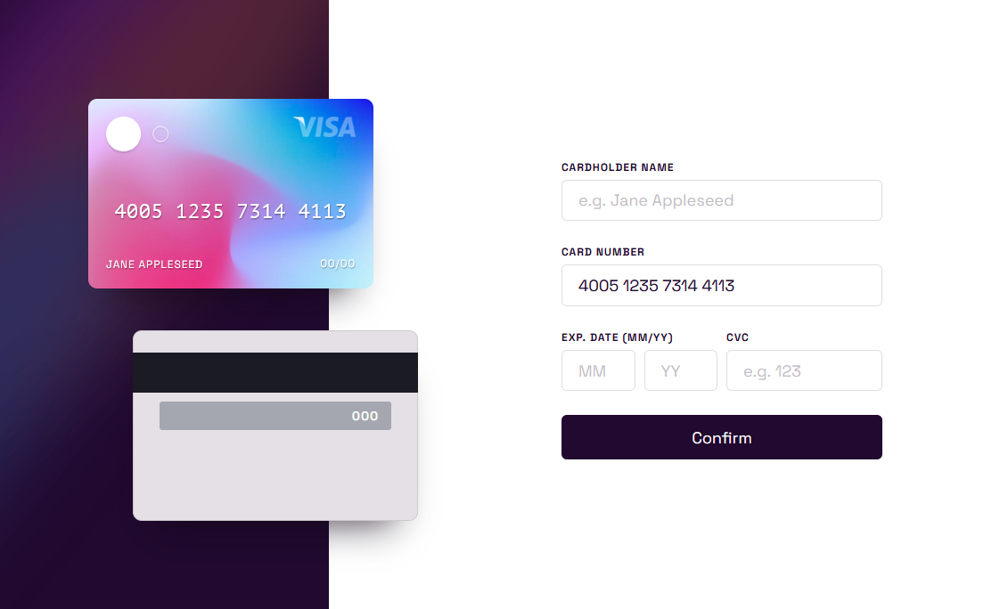
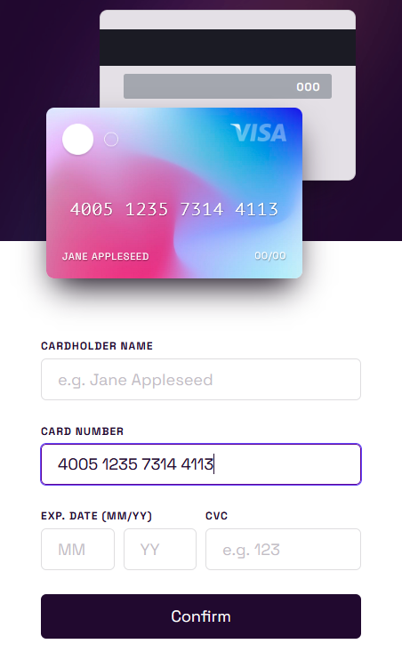

# Frontend Mentor - Interactive card details form solution

This is a solution to the [Interactive card details form challenge on Frontend Mentor](https://www.frontendmentor.io/challenges/interactive-card-details-form-XpS8cKZDWw). Frontend Mentor challenges help you improve your coding skills by building realistic projects.

## Table of contents

- [Overview](#overview)
  - [The challenge](#the-challenge)
  - [Screenshot](#screenshot)
  - [Links](#links)
- [My process](#my-process)
  - [Built with](#built-with)
  - [What I learned](#what-i-learned)
  - [Continued development](#continued-development)
  - [Useful resources](#useful-resources)
- [Author](#author)
- [Acknowledgments](#acknowledgments)

**Note: Delete this note and update the table of contents based on what sections you keep.**

## Overview

### The challenge

Users should be able to:

- Fill in the form and see the card details update in real-time
- Receive error messages when the form is submitted if:
  - Any input field is empty
  - The card number, expiry date, or CVC fields are in the wrong format
- View the optimal layout depending on their device's screen size
- See hover, active, and focus states for interactive elements on the page

### Screenshot

### Links

- Solution URL: [https://www.frontendmentor.io/solutions/simey-credit-card-details-wO4nFeFU3Q](https://www.frontendmentor.io/solutions/simey-credit-card-details-wO4nFeFU3Q)
- Live Site URL: [https://simey-credit-card.netlify.app/](https://simey-credit-card.netlify.app/)

## My process

### Built with

- Semantic HTML5 markup
- CSS custom properties
- Flexbox
- CSS Grid
- Mobile-first workflow
- VueJS (Vue3)
- Vuelidate
- Animate.style

### What I learned

I learned a bunch on re-usable Vue components. Validation (with Vuelidate) and
using the Vue3 reactive API as a reactive Store.

## Author

- Website - [simey.me](https://simey.me)
- Frontend Mentor - [@simeydotme](https://www.frontendmentor.io/profile/simeydotme)
- Twitter - [@simeydotme](https://www.twitter.com/simeydotme)

## Acknowledgments

shout-out to [@CharmaineHYM](https://twitter.com/CharmaineHYM) for allowing me to push her
on her web-dev journey. Teaching/Mentoring others makes us better! Check her profile out
[on codepen](https://codepen.io/Charmaine_Ho) or [https://charmainehym.me/](https://charmainehym.me/)
